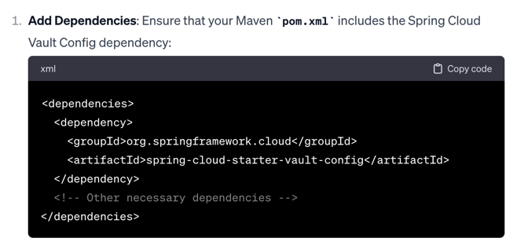
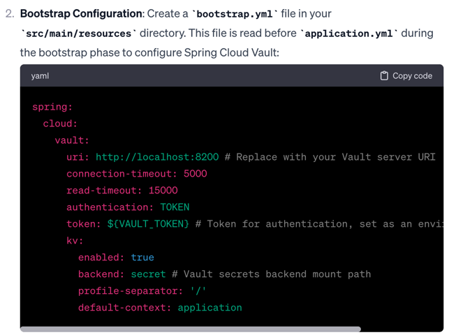
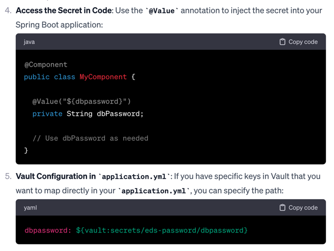

type Query {
  books(filter: BookFilter): [Book]
}

input BookFilter {
  title: String
  author: String
}

type Book {
  title: String
  author: String
}

// Resolver Implementation
const resolvers = {
  Query: {
    books: (parent, args, context, info) => {
      let filteredBooks = myBookArray; 
      if (args.filter) {
        if (args.filter.title) {
          filteredBooks = filteredBooks.filter(book => book.title === args.filter.title);
        }
        if (args.filter.author) {
          filteredBooks = filteredBooks.filter(book => book.author === args.filter.author);
        }
      }
      return filteredBooks;
    },
  },
};

query GetBooks {
  books(filter: { author: "J.K. Rowling" }) {
    title
    author
  }
}

-----------------------------------
#To access a password from HashiCorp Vault

<dependencies>
  <dependency>
    <groupId>org.springframework.cloud</groupId>
    <artifactId>spring-cloud-starter-vault-config</artifactId>
  </dependency>
  <!-- Other necessary dependencies -->
</dependencies>

ya[dev.yaml](dev.yaml)ml

spring:
cloud:
vault:
uri: http://localhost:8200 # Replace with your Vault server URI
connection-timeout: 5000
read-timeout: 15000
authentication: TOKEN
token: ${VAULT_TOKEN} # Token for authentication, set as an environment variable
kv:
enabled: true
backend: secret # Vault secrets backend mount path
profile-separator: '/'
default-context: application

Bootstrap Configuration: Create a bootstrap.yml file in your src/main/resources directory. 
This file is read before application.yml during the bootstrap phase to configure Spring Cloud Vault:

`spring:
cloud:
vault:
uri: http://localhost:8200 # Replace with your Vault server URI
connection-timeout: 5000
read-timeout: 15000
authentication: TOKEN
token: ${VAULT_TOKEN} # Token for authentication, set as an environment variable
kv:
enabled: true
backend: secret # Vault secrets backend mount path
profile-separator: '/'
default-context: application
`

Environment Variable: Set the VAULT_TOKEN environment variable with the token that has permissions to access the secrets in Vault.

Access the Secret in Code: Use the @Value annotation to inject the secret into your Spring Boot application:

java
Copy code
@Component
public class MyComponent {

@Value("${dbpassword}")
private String dbPassword;

// Use dbPassword as needed
}
Vault Configuration in application.yml: If you have specific keys in Vault that you want to map directly in your application.yml, you can specify the path:

yaml
Copy code
dbpassword: ${vault:secrets/eds-password/dbpassword}
Then, Spring will replace ${vault:secrets/eds-password/dbpassword} with the value from Vault when the application context is loaded.

Remember that this is a high-level overview and your actual implementation details may vary based on your Vault setup, such as the authentication method, Vault KV secrets engine version, and your application's specific configuration needs.

Ensure that your Vault server is properly running and accessible from the Spring Boot application, and that the Vault token provided has the correct policies attached to read the desired secrets.

#Regular Expression

^base64-secret:\s*([A-Za-z0-9+/]{40,}={0,2})$

Antrun Plugin with Replace Task:
Use the Maven Antrun Plugin in combination with Ant's replace task, which supports regular expressions. Here's an example of how you could configure it in your pom.xml:

`<project>
<!-- ... other configurations ... -->

    <build>
        <plugins>
            <plugin>
                <groupId>org.apache.maven.plugins</groupId>
                <artifactId>maven-antrun-plugin</artifactId>
                <version>3.0.0</version>
                <executions>
                    <execution>
                        <phase>process-sources</phase>
                        <goals>
                            <goal>run</goal>
                        </goals>
                        <configuration>
                            <target>
                                <!-- Define the directory and include Java files -->
                                <fileset dir="${project.basedir}/src/main/java" includes="**/*.java" id="java-files"/>
                                <replace file="@(java-files)" token="originalRegex" value="replacement" flags="g"/>
                            </target>
                        </configuration>
                    </execution>
                </executions>
            </plugin>
        </plugins>
    </build>
</project>
`

Here's an example of how you can configure your pom.xml to copy hardCodedConfig.yaml from your project's root directory to the src/main/resources folder:

`<project>
<!-- ... other elements like modelVersion, groupId, artifactId, etc. -->

    <build>
        <resources>
            <resource>
                <directory>${project.basedir}</directory>
                <includes>
                    <include>hardCodedConfig.yaml</include>
                </includes>
                <targetPath>${project.build.directory}/classes</targetPath>
            </resource>
            <resource>
                <directory>src/main/resources</directory>
                <!-- include all resources from src/main/resources -->
                <includes>
                    <include>**/*</include>
                </includes>
            </resource>
        </resources>

        <plugins>
            <!-- ... other plugins ... -->

            <!-- Maven Resources Plugin -->
            <plugin>
                <groupId>org.apache.maven.plugins</groupId>
                <artifactId>maven-resources-plugin</artifactId>
                <version>3.2.0</version>
                <executions>
                    <execution>
                        <phase>process-resources</phase>
                        <goals>
                            <goal>resources</goal>
                        </goals>
                    </execution>
                </executions>
            </plugin>
        </plugins>
    </build>
</project>
`

To globally find and replace text in all .java files during a Maven build process, you can use the maven-resources-plugin with a custom configuration. This plugin allows you to filter and replace text in resource files, and with a bit of configuration, you can apply it to your Java source files as well. Here's a step-by-step guide on how to set this up:

Here is an example configuration for your pom.xml:

`
<project>
<!-- ... other configurations ... -->

    <properties>
        <!-- Define the text to find and its replacement here -->
        <text.to.replace>originalText</text.to.replace>
        <replacement.text>newText</replacement.text>
    </properties>

    <build>
        <plugins>
            <plugin>
                <groupId>org.apache.maven.plugins</groupId>
                <artifactId>maven-resources-plugin</artifactId>
                <version>3.1.0</version>
                <executions>
                    <execution>
                        <phase>process-resources</phase>
                        <goals>
                            <goal>resources</goal>
                        </goals>
                        <configuration>
                            <resources>
                                <resource>
                                    <directory>${project.basedir}/src/main/java</directory>
                                    <includes>
                                        <include>**/*.java</include>
                                    </includes>
                                    <filtering>true</filtering>
                                </resource>
                            </resources>
                            <!-- Use the delimiters that won't conflict with Java syntax -->
                            <delimiters>
                                <delimiter>@</delimiter>
                            </delimiters>
                            <useDefaultDelimiters>false</useDefaultDelimiters>
                        </configuration>
                    </execution>
                </executions>
            </plugin>
        </plugins>
    </build>
</project>

`
